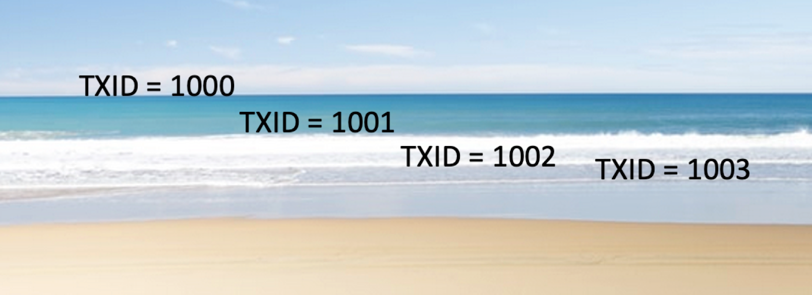

# When Vacuum Doesn't

### MVCC in a Nutshell
* MVCC: Multiversion Concurrency Control
* Each SQL statements sees a version of the data as it was when it started, not the state of the data as it is NOW
* This allows a consistent view of the data while it's undergoing concurrent changes
* If a row is modified, multiple versions of the row exist
* Readers never block Writers, Writers never block Readers
* Everyone is happy! Not so fast ....
* What happens to the old data when no running process needs to see it any longer? ```Dead Data```
* Will ```Dead Data``` just sit on disk and the database continues to grow unbounded?

### Vacuum to the Rescue
#### What are the responsibilites of vacuum?
* Reclaim space used by dead data: table and index tuples, other internal structures
* Mark tuples with a special Frozen "transaction id" to avoid the "Transaction ID Wraparound" problem
* Automated by the "autovacuum" daemon. ```autovacuum = on``` is the default and no reason to ``EVER turn it off``.  

#### How does vacuum determine what data is safe to cleanup?
* The Concept of Xmin Horizon
* Xmin is the transaction id that removed the row
* Xmax is the transaction id that created the row
* Xmin Horizon is the earliest Xmin that any running backend still needs to see.
* Anything older is removable


#### What if vacuum does not vacuum?
* Database bloat = High level of ```Dead Data```
* Performance degreadations: ```"More Bloat, More Problems"```
* At over 2 billion TXIDs, ```"Transaction ID Wraparound prevention"``` takes effect and database is unavailable for writes

#### What prevents vacuum from removing dead data?
* Broadly speaking ```Long running transactions```
* Specifically:
1. ```Long running transactions, including Idle transactions!```
2. ```Inactive or Unconsumed replication slots```
3. ```Long running SELECTS on a replica wiht hot_standby_feedback = on```
4. ```Lingering PREPARED TRANSACTIONS```

#### Monitor the oldest transaction age
* Postgres provides a built-in function called ```age(xid)```
* ```age``` caluclates how many transactions in the past an xid is
* We can use this fact to determine the oldest transaction age for each of the categories mentioned above
```
CREATE OR REPLACE VIEW get_oldest_xid AS
WITH transactions AS
(
         SELECT   
                  pid,
                  COALESCE(backend_xmin, backend_xid)      AS cutoff_xid,
                  Age(COALESCE(backend_xmin, backend_xid)) AS xid_age
         FROM     pg_stat_activity
         WHERE    COALESCE(backend_xmin, backend_xid) IN
                  (
                         SELECT COALESCE(backend_xmin, backend_xid)
                         FROM   pg_stat_activity
                         WHERE  COALESCE(backend_xmin, backend_xid) IS NOT NULL
                  )
         AND Age(COALESCE(backend_xmin, backend_xid)) > 0
         ORDER BY Now()-xact_start DESC nulls last limit 1 ), 
logical_replication_slot AS
(
         SELECT   
                  catalog_xmin           AS cutoff_xid,
                  Age(catalog_xmin)      AS xid_age,
                  slot_name              AS slot_name
         FROM     pg_replication_slots
         WHERE    Age(catalog_xmin) > 0
         AND      slot_type = 'logical'
         ORDER BY Age(catalog_xmin) DESC nulls last limit 1 ), 
prepared_xacts AS
(
         SELECT   
                  TRANSACTION            AS cutoff_xid,
                  Age(TRANSACTION)       AS xid_age,
                  gid                    AS prepared_xact_name
         FROM     pg_prepared_xacts
         WHERE    Age(TRANSACTION) > 0
         ORDER BY Age(TRANSACTION) DESC nulls last limit 1 ), 
physical_replication_slot AS
(
         SELECT   
                  xmin AS cutoff_xid,
                  Age(xmin) AS xid_age
         FROM     pg_replication_slots
         WHERE    Age(xmin) > 0
         AND      slot_type = 'physical'
         ORDER BY Age(xmin) DESC nulls last limit 1 ),
replication_stats AS
(
        SELECT   
                backend_xmin AS cutoff_xid,
                Age(backend_xmin) As xid_age
        FROM pg_stat_replication
        WHERE Age(backend_xmin) > 0
        ORDER BY Age(backend_xmin) DESC nulls last limit 1 )select
       t.cutoff_xid AS transaction_xid,
       t.xid_age AS transaction_age,
       t.pid AS transaction_pid,
       l.cutoff_xid AS logical_replication_xid,
       l.xid_age AS logical_replication_slot_age,
       l.slot_name AS logical_replication_slot_name,
       p.cutoff_xid AS prepared_transaction_xid,
       p.xid_age AS prepared_transaction_age,
       p.prepared_xact_name AS prepared_transaction_name,
       LEAST(f.cutoff_xid::text::int, g.cutoff_xid::text::int) AS hot_standby_feedback_xid,
       Age(LEAST(f.cutoff_xid::text::int, g.cutoff_xid::text::int)::text::xid) As hot_standby_feedback_age
from 
       transactions as t 
       full join 
       logical_replication_slot as l on true
       full join
       prepared_xacts p on true
       full join
       physical_replication_slots f on true
       full join
       replication_stats g on true
;
```

```
postgres=# select * from rds_get_oldest_xid;
-[ RECORD 1 ]-----------------+-------------------
transaction_xid               | 3614994
transaction_age               | 1307440
transaction_pid               | 9068
logical_replication_xid       | 3536518
logical_replication_slot_age  | 1385916
logical_replication_slot_name | regression_slot
prepared_transaction_xid      | 3614994
prepared_transaction_age      | 1307440
prepared_transaction_name     | unused_prepared_tx
hot_standby_feedback_xid      | 3536518
hot_standby_feedback_age      | 1385916

postgres=# select GREATEST(
postgres=# transaction_age, 
postgres=# logical_replication_slot_age, 
postgres=# prepared_transaction_age,
postgres=# hot_standby_feedback_age
postgres=# )  oldest_xid_age
postgres=# from rds_get_oldest_xid;

-[ RECORD 1 ]-----+----------
oldest_xid_age    | 1385916
```
